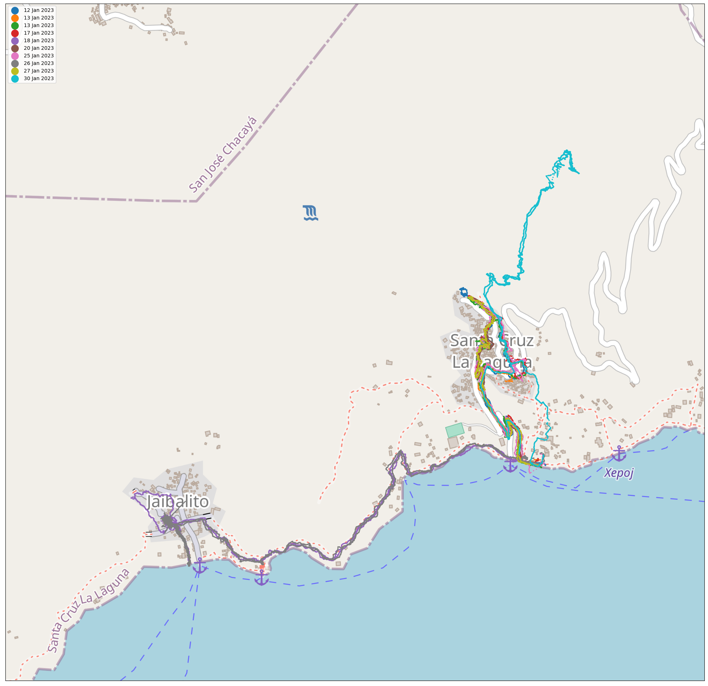

# Hike Clustering and Visualization Project

This project processes, clusters, and plots hike data. It retrieves hike data from a directory, clusters the hikes based on their starting points, and visualizes the hikes on maps. 
A sample of the visualization:

## Key Functions

### `cluster_hikes()`

This function clusters hiking trails based on the proximity of their starting points. The output is grouped hikes and their bounding boxes.

- Parameters:
  - `hikes`: List of hike objects.
  - `max_radius`: Maximum distance (in km) between starting points to consider in the same cluster.
  - `consider_curvature`: Whether to consider the curvature of the earth in bounding box calculations.
  - `sort`: Sorts hikes within each cluster based on date if `True`.
  - `verbose`: If `True`, prints the number of clusters found.

### `crop_image()`

Crops an image with given margins.

- Parameters:
  - `image_path`: Path to the image to crop.
  - `output_path`: Path to save the cropped image.
  - `left, top, right, bottom`: Margins to crop.

### `download_map_image_from_getmap()`

Downloads a map image from the GET-MAP API based on provided bounding box.

- Parameters:
  - Bounding box coordinates: `min_lon`, `max_lon`, `min_lat`, `max_lat`.
  - `save_directory`: Directory to save temporary images.
  - `crop`: Whether to crop the image.
  - `title`: Title of the map.
  - `orientation`: Either 'landscape' or 'portrait'.
  - `return_image`: If `True`, returns a PIL.Image object.

### `get_and_plot_hikes()`

Processes, clusters, and plots hike data. Retrieves hike data, clusters the hikes, downloads maps from GET-MAP, and plots hikes on maps.

- Parameters:
  - `data_dir`: Directory containing hike data.
  - `max_radius`: Maximum radius (in km) for clustering.
  - `margin`: Margin (in degrees) to extend the bounding box.

### `get_hike_objects()`

Retrieves a list of Hike objects based on the TCX and GPX files present in a directory.

- Parameters:
  - `data_dir`: Directory containing the TCX and GPX files.

### `plot_hikes()`

Plots a list of hikes on a given background image and saves the visualization.

- Parameters:
  - `hike_list`: List of hike objects.
  - `bbox`: Bounding box of the area in format (min_longitude, max_longitude, min_latitude, max_latitude).
  - `background_image`: Background image path or a PIL Image object.
  - `save_directory`: Directory where the plot will be saved.

## Getting Started

1. Clone the repository.
2. Navigate to the project directory.
3. Install necessary libraries and dependencies.
4. Place your hike data (TCX and GPX files) in the desired directory.
5. Use the `get_and_plot_hikes()` function to process, cluster, and visualize your hike data.

## Dependencies

Ensure you have the following libraries installed:
- `numpy`
- `matplotlib`
- `scikit-learn`
- `PIL`
- `glob`
- `urllib3`

